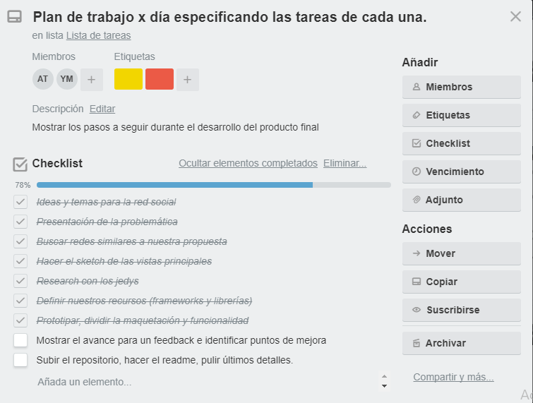
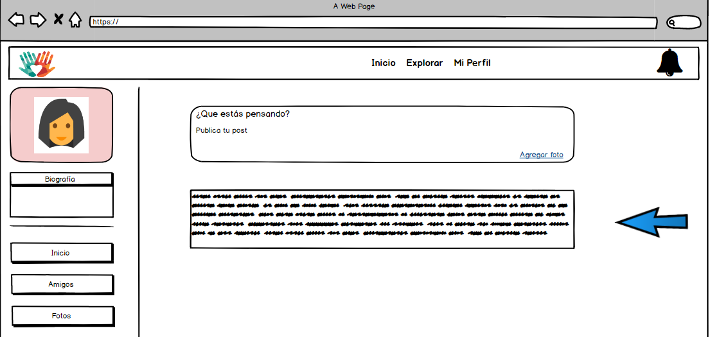

Q'APIRIY
=================
La red social que integra a toda una comunidad dispuesta a colabrorar en el voluntariado mientras Viaja, Comparte y vive nuevas experiencias.


**Problemática**

Usamos Facebook para conectarnos con amigos, Twitter para compartir noticias, LinkedIn para encontrar trabajo, pero ¿dónde podemos publicar o encontrar trabajo de voluntariado de manera fácil y directa en esta era digital?

**Objetivos**

Buscar incrementar el número de voluntarios con una red social que ayude a comunidades, organizaciones sin fines de lucro y la ciudadanía en general a organizarse y promocionar sus esfuerzos por mejorar la calidad de vida de todos.

### Sobre el Producto Final
```
Un emprendedor muy visionario nos ha encargado crear una red social. No nos da mucho detalle sobre qué tipo de red social quiere, él solo nos dice que creemos la que mejor podamos y que luego lo convenzamos de que nuestra red social será la más exitosa.
```

### Producto Mínimo Viable
**Puntos Básicos!**
* Perfiles de usuarios
* Un newsfeed donde puedes ver las actualizaciones de todos tus contactos
* Un lugar donde poder escribir posts
* Un lugar para subir fotos
* Capacidad para poder tener amigos o para poder seguir a personas/marcas dentro de la red social
* Ser mobile friendly

### Plan de Organización
**Trello**



### Definición del Diseño
**Sketching**


### Diseño de la Interfaz
**Wireframe**



### Recursos Utilizamos

* Balsamic [Wireframe](https://balsamiq-wireframes.appspot.com/?state=%7B%22ids%22:%5B%221luYOzc8f3d7WC7jjgMs7ayPkdxSjJpvR%22%5D,%22action%22:%22open%22,%22userId%22:%22102231506663480280950%22%7D)

* Trello [Trello](https://trello.com/b/m0T7VJ0U/qapiriy)
* HTML5
* CSS3
* Jquery
* Materialize
